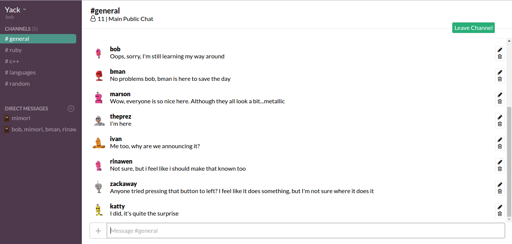

# Yack

## Summary
Yack is a Slack-based real-time messaging application for communication between groups. It allows users to post messages and have them immediately read by everyone in the channel, join public channels available to everyone, and create private direct message channels between a user or groups of users.

## Structure
Yack is built using Ruby on Rails with a PostgreSQL database. Rails' Action Cable framework was used to provide real-time capability. The front end was built using React and Redux.

## Features

### Users
In the database, Users have personal information for `username`, `first_name`, `last_name`, and `email`. This information is secured with a `password_digest` column, which utilizes the `bcrypt` gem to produce a secure password digest from the user's selected password. A `session_token` is used to identify the session. A `gravatar_url` is produced from the provided email and added when the user is saved to the database to provide users with a profile picture using Gravatars (Globally Recognized Avatar)s.

### Chatrooms
On the database side chatrooms are stored in a single table containing columns for the `room_title`, `room_type` describing if the channel is a public channel or a private direct message channel, and an optional `room_purpose` that can be displayed in the channel information heading at the top of the main page. These chatrooms are linked to a `User` through use of `UserChat` join table model, which has foreign keys for both a user and a chatroom. After login, the channels to which a user is subscribed to will be retrieved from the database. On selection of a channel from the sidebar, the user will navigate to the selected channel and the channel's specific information including messages and channel stats will be obtained from the database.

Chatrooms are rendered primarily in 2 different React components. The `ChannelPicker` component is responsible for rendering a list of the channels available to the current user. This component contains buttons to 2 different React Modal components, one to join Public channels, and one to create private Direct Message Channels. The `CurrentChannel` component contains two subcomponents that describe the information contained in the channel. The `ChannelInfo` component contains basic channel information such as the title and number of users belonging to the channel. Below that are subcomponents corresponding to individual message information.

### Messages
Messages are stored in the database with columns for the `content` of the message, as well as foreign keys for the `user_id` of the user who wrote the message along with the `chatroom_id` for the chatroom that it was written in. Users may edit (not yet implemented) and delete their own messages. Users are able to create messages to post on Chatrooms.

### Real Time Messaging
The Action Cable framework included with Rails 5 is utilized to allow messages submitted in a channel from one user to be immediately visible to any other users in the channel. Action Cable uses a Publish-Subscribe model, where the publishers, as information senders, send data to an abstract class of recipient subscribers instead of sending messages to specific recipient users.

## Screenshot

## Future Directions for the Project
1. *Real-time notifications*: While messages will currently update as they are posted, changes in channel subscriptions will not. Action Cable can be used to update this information for users in real time. This can also be used to update whether users appear online in real-time or not.
2. *Attachments*: Add ability for users to upload attachments for use in the chatroom and profile information using the Paperclip gem. Attachments would allow users to share files over the chatroom, while also letting users update their own profiles pictures instead of relying on email-based gravatars.
3. *Email Integration*: Currently email is only used for Gravatars. In the future it can be implemented for security features as well, such as by adding an activation email step instead of automatically logging a user in. Password recovery emails can also be implemented in a similar way.
4. *Emojis*: A popular part of slack is emoji support, where people can insert emojis into their messages. There are several options that can be integerated with React such as react-emoji-picker.
